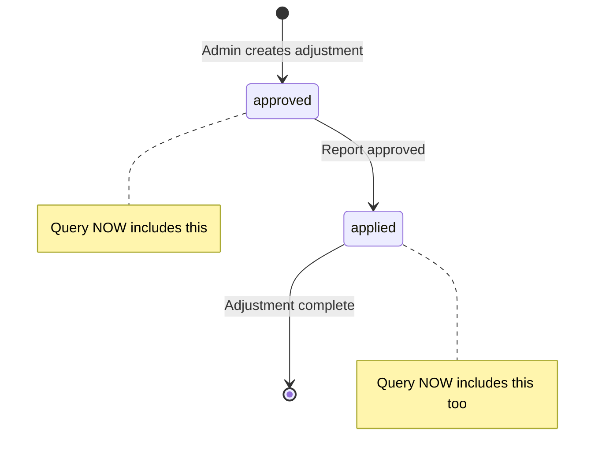

# Fix: Include 'Applied' Adjustments in Queries

## Problem Identified
Purple badges were not showing for reports that had already been approved, because the adjustment status changes from 'approved' to 'applied' when a report is approved.

**Before:** All queries filtered for `status = 'approved'` only
**Result:** Applied adjustments (already linked to approved reports) were not being fetched
**Symptom:** Console showed "Fetched 0 adjustments" even though adjustments existed

## Root Cause

### Adjustment Status Lifecycle:
```
1. Admin creates adjustment → status = 'approved' (auto-approved)
2. Driver submits report
3. Admin approves report → status changes to 'applied'
4. Adjustment is linked to report via 'applied_to_report' field
```

### The Problem:
```sql
-- OLD QUERY (Broken):
SELECT * FROM common_adjustments 
WHERE status = 'approved'  -- ❌ Misses applied adjustments!

-- If report already approved, adjustment status = 'applied'
-- Query returns 0 results
-- No purple badge shows
```

## Solution

Changed all queries to include BOTH 'approved' and 'applied' statuses:

```sql
-- NEW QUERY (Fixed):
SELECT * FROM common_adjustments 
WHERE status IN ('approved', 'applied')  -- ✅ Gets both!
```

## Changes Made

### 1. AdminReports.tsx ✅
**File:** `src/pages/admin/AdminReports.tsx`
**Function:** `fetchServiceDayAdjustments` (line 367-401)

**Before:**
```typescript
let query = supabase.from("common_adjustments").select("*");
// No status filter (would get all statuses)
```

**After:**
```typescript
let query = supabase
  .from("common_adjustments")
  .select("*")
  .in("status", ["approved", "applied"]); // ✅ Explicit filter
```

**Console Output:**
```
AdminReports: Fetched X adjustments (approved or applied)
```

### 2. AdminCalendar.tsx ✅
**File:** `src/pages/admin/AdminCalendar.tsx`
**Function:** `fetchServiceDayAdjustments` (line 159-180)

**Before:**
```typescript
.eq("status", "approved") // Only approved
```

**After:**
```typescript
.in("status", ["approved", "applied"]) // Both statuses
```

**Console Output:**
```
Fetched adjustments: X records (approved or applied)
```

### 3. UberAuditManager.tsx - fetchReportSummary ✅
**File:** `src/components/admin/uber/UberAuditManager.tsx`
**Function:** `fetchReportSummary` (line 692-706)

**Before:**
```typescript
.eq("status", "approved")
```

**After:**
```typescript
.in("status", ["approved", "applied"])
```

**Console Output:**
```
UberAudit ReportSummary: Fetched X adjustments (approved or applied)
```

### 4. UberAuditManager.tsx - fetchCalendarData ✅
**File:** `src/components/admin/uber/UberAuditManager.tsx`
**Function:** `fetchCalendarData` (line 861-875)

**Before:**
```typescript
.eq("status", "approved")
```

**After:**
```typescript
.in("status", ["approved", "applied"])
```

**Console Output:**
```
UberAudit: Fetched X adjustments for [id] (approved or applied)
```

## Expected Behavior Now

### Before Fix:
```
User creates adjustment → status = 'approved'
Report gets approved → adjustment status = 'applied'
Query only checks 'approved' → Returns 0 results ❌
Console: "Fetched 0 adjustments"
No purple badge
```

### After Fix:
```
User creates adjustment → status = 'approved'
Report gets approved → adjustment status = 'applied'
Query checks ['approved', 'applied'] → Returns adjustment ✅
Console: "Fetched 1 adjustments (approved or applied)"
Purple badge shows!
```

## Status State Diagram



## Testing

### Test Scenario 1: New Adjustment (Not Applied Yet)
1. Create adjustment → status = 'approved'
2. Check calendar before report approval
3. **Expected:** Console shows "Fetched 1 adjustments"
4. **Expected:** Report row shows purple when status is approved

### Test Scenario 2: Applied Adjustment (Report Already Approved)
1. Adjustment already created and report approved → status = 'applied'
2. Check any calendar/report view
3. **Expected:** Console shows "Fetched 1 adjustments (approved or applied)"
4. **Expected:** Purple badge shows on calendar

### Test Scenario 3: Your Specific Case
User: `8c08c113-def7-480f-9f14-c447680c20e2`
- Has 2 adjustments (status = 'applied')
- **Before:** Console showed "Fetched 0 adjustments"
- **After:** Console should show "Fetched 2 adjustments (approved or applied)"
- **Result:** Purple badges now appear

## Console Output Changes

### Before:
```
UberAudit ReportSummary: Fetched 0 adjustments
UberAudit: Fetched 0 adjustments for 8c08c113-def7-480f-9f14-c447680c20e2
```

### After:
```
UberAudit ReportSummary: Fetched 2 adjustments (approved or applied)
UberAudit: Fetched 2 adjustments for 8c08c113-def7-480f-9f14-c447680c20e2 (approved or applied)
UberAudit: Report has adjustment on 2024-01-15
UberAudit: Report has adjustment on 2024-01-16
```

## Why Include Both Statuses?

| Status | Meaning | Should Show in Calendar? | Reason |
|--------|---------|-------------------------|---------|
| `approved` | Adjustment created, not yet applied to report | ✅ Yes | Pre-approval visualization |
| `applied` | Adjustment already applied to approved report | ✅ Yes | Historical record, show it was adjusted |
| `pending` | Waiting for approval | ❌ No | Not confirmed yet |
| `rejected` | Denied by admin | ❌ No | Should not show |

## Database Query Comparison

### Old Query:
```sql
SELECT * FROM common_adjustments
WHERE user_id = '8c08c113-def7-480f-9f14-c447680c20e2'
  AND status = 'approved'  -- ❌ Misses status='applied'
  AND adjustment_date BETWEEN '2024-01-15' AND '2024-01-21';
  
-- Result: 0 rows (because status is 'applied', not 'approved')
```

### New Query:
```sql
SELECT * FROM common_adjustments
WHERE user_id = '8c08c113-def7-480f-9f14-c447680c20e2'
  AND status IN ('approved', 'applied')  -- ✅ Gets both
  AND adjustment_date BETWEEN '2024-01-15' AND '2024-01-21';
  
-- Result: 2 rows (status='applied' records are now included)
```

## Files Modified

1. **`src/pages/admin/AdminReports.tsx`**
   - Line 370-373: Added `.in("status", ["approved", "applied"])`
   - Line 396: Updated console log

2. **`src/pages/admin/AdminCalendar.tsx`**
   - Line 168: Changed from `.eq("status", "approved")` to `.in("status", ["approved", "applied"])`
   - Line 174: Updated console log

3. **`src/components/admin/uber/UberAuditManager.tsx`**
   - Line 697: Changed from `.eq("status", "approved")` to `.in("status", ["approved", "applied"])`
   - Line 705: Updated console log
   - Line 866: Changed from `.eq("status", "approved")` to `.in("status", ["approved", "applied"])`
   - Line 874: Updated console log

## Verification Steps

1. **Check your specific user:**
   - Open UberAudit for user `8c08c113-def7-480f-9f14-c447680c20e2`
   - Open console (F12)
   - Should now see: "Fetched 2 adjustments (approved or applied)"

2. **Check database directly:**
   ```sql
   SELECT status, COUNT(*) 
   FROM common_adjustments 
   WHERE user_id = '8c08c113-def7-480f-9f14-c447680c20e2'
   GROUP BY status;
   
   -- Should show:
   -- applied | 2
   ```

3. **Verify purple badges:**
   - Navigate to any calendar view
   - Purple badges should now appear for adjusted reports
   - Console confirms adjustments are loaded

## Success Criteria

- ✅ Console shows non-zero adjustment count for users with adjustments
- ✅ Both 'approved' and 'applied' adjustments are fetched
- ✅ Purple badges appear for reports with adjustments
- ✅ Works in AdminReports, AdminCalendar, and UberAuditManager
- ✅ Console log clearly indicates "(approved or applied)"

## Important Note

This fix ensures that adjustments remain visible even after they've been applied to reports. This is important for:
- Historical tracking
- Audit trails
- Verification that adjustments were properly applied
- Calendar visualization of adjusted vs non-adjusted reports
