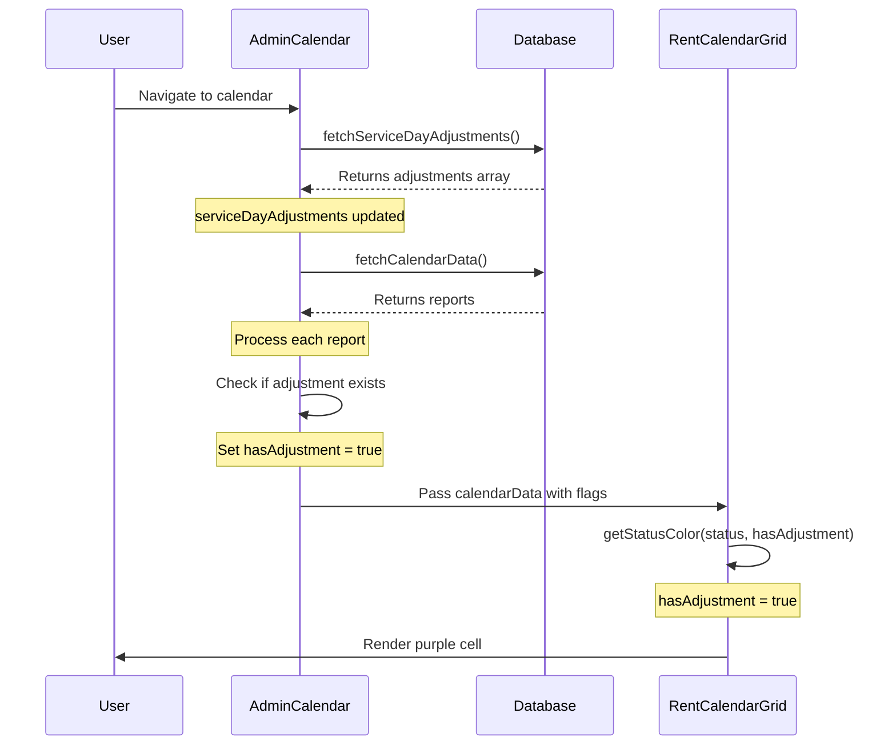

# Fix: Purple Badge Not Showing in Calendar

## Problem
Purple badges for adjustment reports were not showing in the calendar views despite the code being implemented.

## Root Cause
**Race Condition:** The `fetchCalendarData()` and `fetchServiceDayAdjustments()` functions were running in parallel in the useEffect. The calendar data was being processed before the adjustments were loaded, so the `hasAdjustment` flag was always false.

## Solution
Made the data loading sequential:
1. Fetch adjustments FIRST (await)
2. THEN fetch calendar data (await)
3. This ensures adjustment data is available when processing calendar reports

## Changes Made

### AdminCalendar.tsx

#### 1. Updated useEffect to Load Data Sequentially
**Before:**
```typescript
useEffect(() => {
  fetchDrivers();
  fetchCalendarData(); // Runs immediately
  fetchRentHistory();
  fetchShiftHistory();
  fetchOfflineRecords();
  fetchServiceDayAdjustments(); // Runs in parallel
}, [weekOffset, selectedDriver, selectedShift, startDate, endDate]);
```

**After:**
```typescript
useEffect(() => {
  const loadData = async () => {
    fetchDrivers();
    fetchRentHistory();
    fetchShiftHistory();
    fetchOfflineRecords();
    // Fetch adjustments first, then calendar data
    await fetchServiceDayAdjustments(); // ✅ Wait for adjustments
    await fetchCalendarData(); // ✅ Then load calendar
  };
  loadData();
}, [weekOffset, selectedDriver, selectedShift, startDate, endDate]);
```

#### 2. Added Debug Logging
**Added to fetchServiceDayAdjustments:**
```typescript
console.log("Fetched adjustments:", data?.length || 0, "records");
```

**Added to calendar data processing:**
```typescript
if (hasAdjustment) {
  console.log(`Report has adjustment: ${report.driverName} on ${report.date}`);
}
```

#### 3. Made fetchServiceDayAdjustments Return Data
**Before:**
```typescript
const fetchServiceDayAdjustments = async () => {
  // ... fetch logic
  setServiceDayAdjustments(data || []);
};
```

**After:**
```typescript
const fetchServiceDayAdjustments = async () => {
  // ... fetch logic
  console.log("Fetched adjustments:", data?.length || 0, "records");
  setServiceDayAdjustments(data || []);
  return data || []; // ✅ Return data for chaining if needed
};
```

## How It Works Now

### Sequence of Events:
```
1. User navigates to AdminCalendar
2. useEffect triggers
3. fetchServiceDayAdjustments() runs → loads adjustments from common_adjustments
4. State updates: serviceDayAdjustments = [adjustment1, adjustment2, ...]
5. fetchCalendarData() runs → processes reports
6. For each report: checks if serviceDayAdjustments contains matching entry
7. Sets hasAdjustment = true if match found
8. RentCalendarGrid receives data with hasAdjustment flag
9. getStatusColor() checks hasAdjustment flag
10. Purple color applied: bg-purple-400
```

### Data Flow Diagram:


## Testing

### Console Output to Check:
When you load the calendar, you should see:
```
Fetched adjustments: X records
Report has adjustment: [Driver Name] on [Date]
```

### Visual Check:
1. Open AdminCalendar page
2. Open browser console (F12)
3. Look for "Fetched adjustments" message
4. Calendar cells for adjusted reports should be purple
5. If you see "Report has adjustment" in console but no purple, the issue is in CalendarUtils.getStatusColor()

### If Purple Still Not Showing:

#### Check 1: Are adjustments being fetched?
```typescript
// Should see in console:
"Fetched adjustments: [number] records"
```

#### Check 2: Are reports being matched?
```typescript
// Should see in console for each adjusted report:
"Report has adjustment: [driver name] on [date]"
```

#### Check 3: Is the flag reaching RentCalendarGrid?
Add this to RentCalendarGrid.tsx (line 733):
```typescript
console.log("rentData:", rentData?.driverName, "hasAdjustment:", rentData?.hasAdjustment);
```

#### Check 4: Is getStatusColor receiving the flag?
Add this to CalendarUtils.ts getStatusColor function (line 336):
```typescript
console.log("getStatusColor:", status, "hasAdjustment:", hasAdjustment);
```

## Files Modified

1. **`src/pages/admin/AdminCalendar.tsx`**
   - Line 55-63: Updated useEffect to load data sequentially
   - Line 155-173: Added console logging and return value
   - Line 232-273: Added console logging for adjustment matches

## Expected Behavior

### Before Fix:
- Calendar loads
- Adjustments fetch starts
- Calendar data processes immediately (adjustments not ready yet)
- hasAdjustment = false for all reports
- No purple badges

### After Fix:
- Calendar loads
- Adjustments fetch completes ✅
- Calendar data processes (adjustments available) ✅
- hasAdjustment = true for adjusted reports ✅
- Purple badges show ✅

## Verification Steps

1. **Create a test adjustment:**
   - Go to Common Adjustments tab
   - Create adjustment for a driver/date
   - Ensure status = 'approved'

2. **Check database:**
   ```sql
   SELECT * FROM common_adjustments 
   WHERE status = 'approved' 
   AND adjustment_date = '2024-01-15'; -- your test date
   ```

3. **Load AdminCalendar:**
   - Navigate to the date with adjustment
   - Open console (F12)
   - Should see: "Fetched adjustments: 1 records"
   - Should see: "Report has adjustment: [name] on [date]"
   - Cell should be purple

4. **Check other calendars:**
   - RentCalendarGrid (in Admin Dashboard)
   - UberAuditManager
   - All should show purple for the same date

## Common Issues

### Issue 1: No adjustments fetched
**Symptom:** Console shows "Fetched adjustments: 0 records"
**Solution:** Check `common_adjustments` table has records with `status='approved'`

### Issue 2: Adjustments fetched but not matched
**Symptom:** Has adjustments but no "Report has adjustment" messages
**Solution:** Check that `adj.user_id` matches `report.userId` and `adj.adjustment_date` matches `report.date`

### Issue 3: Matched but no purple color
**Symptom:** Console shows match but cell is green not purple
**Solution:** Check CalendarUtils.getStatusColor() - should check hasAdjustment flag and return purple

## Success Criteria

- ✅ Console shows "Fetched adjustments: X records" where X > 0
- ✅ Console shows "Report has adjustment" for each adjusted report
- ✅ Calendar cells are purple (`bg-purple-400`) for adjusted reports
- ✅ Works in AdminCalendar, RentCalendarGrid, and UberAuditManager
- ✅ Purple only shows for approved/paid status (not pending/rejected)

## Next Steps If Still Not Working

If purple badges still don't show after this fix:

1. **Check adjustment status:** Must be 'approved' not 'applied'
2. **Check report status:** Must be 'approved' or 'paid'
3. **Check date matching:** Ensure date formats match exactly
4. **Check user_id matching:** Ensure UUIDs match exactly
5. **Clear browser cache:** Hard refresh (Ctrl+Shift+R)
6. **Check CalendarUtils:** Verify getStatusColor() logic is correct
