# Penalty System for Incomplete Trips - UberAuditManager

## Overview
Automatic penalty detection and one-click penalty addition for drivers who don't complete 10 trips per day. Penalties are added to the R/F (Refund/Fine) balance system, NOT as adjustments.

## System Architecture

```
┌─────────────────────────────────────────────────┐
│         Weekly Audit Dashboard                   │
├─────────────────────────────────────────────────┤
│                                                  │
│  Financial Summary (Left Side)                   │
│  - Weekly Rent                                   │
│  - Deposit Cutting                               │
│  - Total Adjustments                             │
│  - Final Pay                                     │
│  - Cash at Bank                                  │
│  - Difference                                    │
│                                                  │
│  ⚠️ Penalty Warning (if trips < 10)             │
│  [Add Penalty ₹X]                               │
│                                                  │
├─────────────────────────────────────────────────┤
│                                                  │
│  R/F Management (Right Side)                     │
│  - Current Balance: ₹X                           │
│  - Penalty History                               │
│  - Recent Transactions                           │
│                                                  │
└─────────────────────────────────────────────────┘
```

## Key Distinction

### ❌ NOT in Adjustments
- Adjustments = Discounts/bonuses that REDUCE what driver pays
- Located in: `common_adjustments` table
- Affects: `Final Pay` calculation (subtracts from rent)

### ✅ Added to R/F (Penalty Balance)
- Penalties = Additional amounts driver owes SEPARATE from weekly rent
- Located in: `driver_penalty_transactions` table
- Affects: `Current Balance` in R/F section (adds to penalties)

## Data Flow

```mermaid
flowchart TD
    A[Scan Weekly Reports] --> B{Any Report < 10 trips?}
    B -->|No| END[No Penalty Button]
    B -->|Yes| C[Show Penalty Warning]
    C --> D[Display Incomplete Days List]
    D --> E[Calculate: Days × ₹100]
    E --> F[Show 'Add Penalty' Button]
    
    F --> G[Admin Clicks Button]
    G --> H[Insert to driver_penalty_transactions]
    H --> I[Set type = 'penalty']
    I --> J[Refresh R/F Balance]
    J --> K[Display in Transaction History]
    
    style H fill:#ff6b6b
    style I fill:#ff6b6b
    style J fill:#ff6b6b
```



## Database Tables

### driver_penalty_transactions
**Purpose:** Track all penalty/refund/bonus transactions for drivers

**Schema:**
```sql
CREATE TABLE driver_penalty_transactions (
  id UUID PRIMARY KEY,
  user_id UUID REFERENCES users(id),
  amount DECIMAL(10,2),
  type VARCHAR(50), -- 'penalty', 'penalty_paid', 'bonus', 'refund', 'due', 'extra_collection'
  description TEXT,
  created_at TIMESTAMP,
  created_by UUID REFERENCES users(id)
);
```

**Transaction Types:**
- `penalty` = Driver owes money (negative balance)
- `penalty_paid` = Driver paid penalty (positive, reduces debt)
- `bonus` = Driver receives bonus (positive)
- `refund` = Driver receives refund (positive)
- `due` = Additional due amount (negative)
- `extra_collection` = Extra collection penalty (negative)

### Balance Calculation Logic

```typescript
// From fetchPenaltyTransactions function:
let totalPenalties = 0;
let totalPenaltyPaid = 0;
let totalRefunds = 0;
let totalBonuses = 0;

for each transaction:
  switch (type) {
    case "penalty":
      totalPenalties += amount;
      break;
    case "penalty_paid":
      totalPenaltyPaid += amount;
      break;
    case "bonus":
      totalBonuses += amount;
      break;
    case "refund":
      totalRefunds += amount;
      break;
    case "due":
    case "extra_collection":
      totalPenalties += amount;
      break;
  }

// Calculate balance
totalCredits = totalPenaltyPaid + totalRefunds + totalBonuses;
netAmount = totalCredits - totalPenalties;

// Display
if (netAmount < 0):
  "Driver owes penalties: -₹X" (RED)
else if (netAmount > 0):
  "Refund balance: ₹X" (GREEN)
else:
  "No balance" (GRAY)
```

## Penalty Button Implementation

### Trigger Condition
```typescript
const incompleteDays = reportSummary.reports.filter((report) => {
  const trips = Number(report.total_trips) || 0;
  const status = report.status?.toLowerCase();
  return trips < 10 && status === "approved";
});

// Show button if incompleteDays.length > 0
```

### Penalty Calculation
```typescript
const penaltyAmount = incompleteDays.length * 100;
// ₹100 per incomplete day
```

### Visual Display
```tsx
⚠️ Incomplete Trips Detected

2 day(s) with less than 10 trips

Dec 15: 8 trips
Dec 17: 6 trips

[Add Penalty ₹200]
```

### Button Click Action
```typescript
onClick={async () => {
  // 1. Get current user
  const { data: { user } } = await supabase.auth.getUser();
  
  // 2. Insert penalty transaction
  await supabase
    .from("driver_penalty_transactions")
    .insert({
      user_id: selectedAudit.user_id,
      amount: penaltyAmount, // e.g., 200
      type: "penalty",
      description: `Penalty for ${incompleteDays.length} day(s) with less than 10 trips (₹100/day)`,
      created_by: user.id,
    });
  
  // 3. Refresh penalty balance
  await fetchPenaltyTransactions(selectedAudit.user_id);
  
  // 4. Show toast
  toast({
    title: "Penalty Added",
    description: `₹${penaltyAmount} penalty added to R/F for ${incompleteDays.length} incomplete day(s)`,
  });
}}
```

## User Flow Example

### Before Penalty
```
┌─────────────────────────────────────────┐
│      Financial Summary                   │
├─────────────────────────────────────────┤
│ Weekly Rent: ₹4,900                     │
│ Deposit Cutting: ₹500                   │
│ Total Adjustments: ₹0                   │
│ Final Pay: ₹5,400                       │
│ Cash at Bank: ₹5,400                    │
│ Difference: ₹0 ⚫                        │
└─────────────────────────────────────────┘

┌─────────────────────────────────────────┐
│      R/F Management                      │
├─────────────────────────────────────────┤
│ Current Balance: ₹0                      │
│ No balance                               │
└─────────────────────────────────────────┘
```

### Penalty Detected
```
⚠️ Incomplete Trips Detected

2 day(s) with less than 10 trips
Dec 15: 8 trips
Dec 17: 6 trips

[Add Penalty ₹200] ← Button appears
```

### After Clicking "Add Penalty ₹200"
```
┌─────────────────────────────────────────┐
│      Financial Summary                   │
├─────────────────────────────────────────┤
│ Weekly Rent: ₹4,900                     │
│ Deposit Cutting: ₹500                   │
│ Total Adjustments: ₹0                   │
│ Final Pay: ₹5,400                       │  ← Unchanged
│ Cash at Bank: ₹5,400                    │  ← Unchanged
│ Difference: ₹0 ⚫                        │  ← Unchanged
└─────────────────────────────────────────┘

┌─────────────────────────────────────────┐
│      R/F Management                      │
├─────────────────────────────────────────┤
│ Current Balance: -₹200 🔴               │  ← Changed!
│ Driver owes penalties                    │
│                                          │
│ Recent Transactions:                     │
│ ⚠️ Penalty - ₹200                       │
│ "Penalty for 2 day(s) with less than    │
│  10 trips (₹100/day)"                   │
│ Just now                                 │
└─────────────────────────────────────────┘
```

## Important Notes

### Why Separate from Adjustments?

1. **Different Purpose**
   - Adjustments = Discounts on weekly rent (service day, bonus, etc.)
   - Penalties = Additional fines tracked separately

2. **Different Calculation**
   - Adjustments: Reduce `Final Pay` immediately
   - Penalties: Accumulated in R/F balance over time

3. **Different Payment Flow**
   - Weekly Rent: Paid weekly via `rent_paid_amount`
   - Penalties: Paid separately via penalty_paid transactions

4. **Better Tracking**
   - R/F system maintains running balance
   - Can track when penalties are paid
   - Historical record of all penalties

### Penalty vs Adjustment Example

**Scenario:** Driver works 6 days, 2 days have < 10 trips

**Option 1: As Adjustment (OLD - WRONG)**
```
Weekly Rent: 6 × ₹700 = ₹4,200
Penalty Adjustment: -₹200
Final Pay: ₹4,200 - ₹200 = ₹4,000

Result: Driver pays ₹4,000 this week
Problem: Penalty is a discount! Driver benefits from poor performance
```

**Option 2: As R/F Penalty (NEW - CORRECT)**
```
Weekly Rent: 6 × ₹700 = ₹4,200
Final Pay: ₹4,200
Driver pays: ₹4,200 this week

R/F Balance: -₹200 (separate penalty)

Result: 
- Driver pays ₹4,200 for weekly rent
- Driver ALSO owes ₹200 penalty (tracked separately)
- Total owed: ₹4,400
```

## R/F Balance Colors

```typescript
if (currentDriverPenalties < 0) {
  color = "text-red-600";
  text = `-₹${Math.abs(currentDriverPenalties)}`;
  label = "Driver owes penalties";
} else if (currentDriverPenalties > 0) {
  color = "text-green-600";
  text = `₹${currentDriverPenalties}`;
  label = "Refund balance";
} else {
  color = "text-gray-600";
  text = "₹0";
  label = "No balance";
}
```

| Balance | Color | Display | Meaning |
|---------|-------|---------|---------|
| -₹500 | 🔴 Red | `-₹500` | Driver owes ₹500 in penalties |
| ₹300 | 🟢 Green | `₹300` | Company owes driver ₹300 refund |
| ₹0 | ⚫ Gray | `₹0` | No outstanding balance |

## Integration Points

### 1. Financial Summary Section
- Shows penalty warning
- Shows "Add Penalty" button
- Does NOT affect Final Pay calculation
- Does NOT affect Difference

### 2. R/F Management Section
- Displays updated balance after penalty added
- Shows penalty in transaction history
- Updates "Current Balance" immediately

### 3. Transaction History
- New penalty appears at top
- Shows description with day count
- Shows timestamp ("Just now")
- Shows penalty icon (⚠️)

## Testing Scenarios

### Test 1: Single Incomplete Day
```
Input: 1 report with 8 trips (approved)
Expected:
- Warning shows: "1 day(s) with less than 10 trips"
- Button shows: "Add Penalty ₹100"
- After click: R/F balance = -₹100
```

### Test 2: Multiple Incomplete Days
```
Input: 3 reports with < 10 trips (approved)
Expected:
- Warning shows: "3 day(s) with less than 10 trips"
- Lists up to 3 days with trip counts
- Button shows: "Add Penalty ₹300"
- After click: R/F balance = -₹300
```

### Test 3: More Than 3 Incomplete Days
```
Input: 5 reports with < 10 trips (approved)
Expected:
- Warning shows: "5 day(s) with less than 10 trips"
- Lists first 3 days
- Shows "+2 more day(s)"
- Button shows: "Add Penalty ₹500"
```

### Test 4: Pending/Rejected Reports
```
Input: 
- 2 approved reports < 10 trips
- 1 pending report < 10 trips
- 1 rejected report < 10 trips
Expected:
- Only counts approved reports
- Warning shows: "2 day(s) with less than 10 trips"
- Button shows: "Add Penalty ₹200"
```

### Test 5: All Days Complete
```
Input: All reports have >= 10 trips
Expected:
- No warning displayed
- No penalty button
- Financial Summary shows normally
```

## Code Files Modified

### /src/components/admin/uber/UberAuditManager.tsx

**Lines 1649-1741:** Penalty button implementation

**Key Changes:**
1. Changed insert table from `common_adjustments` to `driver_penalty_transactions`
2. Removed `vehicle_number`, `driver_name`, `adjustment_date` fields
3. Removed `status`, `approved_by` fields (penalties are not "approved")
4. Set `type` to "penalty" (transaction type)
5. Changed refresh call from `fetchReportSummary()` to `fetchPenaltyTransactions()`
6. Updated toast message to mention "R/F"

## Benefits

1. **Correct Accounting** - Penalties increase driver debt, not reduce it
2. **Separate Tracking** - R/F system maintains clear penalty history
3. **Payment Flexibility** - Penalties can be paid separately from weekly rent
4. **Better Reporting** - Transaction history shows all penalties clearly
5. **No Confusion** - Adjustments remain for discounts/bonuses only
6. **Audit Trail** - Clear record of when/why penalties were added

## Summary

The penalty button now correctly adds incomplete trip penalties to the **R/F (Refund/Fine) balance system** via the `driver_penalty_transactions` table, instead of adding them as adjustments. This ensures:

- Penalties **increase** what driver owes (not decrease)
- Separate tracking from weekly rent
- Clear transaction history
- Proper accounting and reporting
